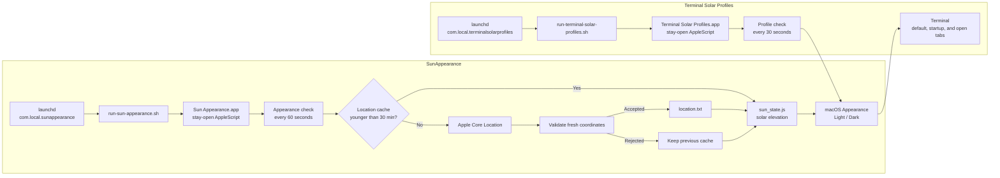

# Sun Appearance Utilities for macOS Monterey

Two small local utilities for macOS Monterey that keep the system and Terminal appearance synchronized with the actual local sunrise and sunset.

These were built and tested for **macOS Monterey 12.7.6**.

## Utilities

### 1. SunAppearance

`SunAppearance` replaces macOS's built-in **Appearance → Auto** behavior.

macOS normally waits until the Mac has been idle before switching between Light and Dark appearance. This utility instead checks the sun's actual position and changes the system appearance without waiting for an idle period.

#### Behavior

- Checks the desired appearance every **60 seconds**.
- Uses **Apple Core Location** to obtain the Mac's current latitude and longitude.
- Refreshes the location every **30 minutes**.
- Lets macOS request Location Services permission automatically when location updates start.
- Validates fresh coordinates before replacing the cached location.
- Records Core Location refresh/authorization diagnostics in an append-only local log.
- Retains the last successful location if Core Location temporarily fails or a fresh coordinate is rejected as suspicious.
- Falls back to **Sedona, Arizona** (`34.8697, -111.7609`) if no location has ever been obtained.
- Calculates sunrise and sunset locally using the conventional apparent-horizon value of **-0.833°**.
- Does **not** send location information to a web service.
- Changes macOS to:
  - **Light** when the sun is above the sunrise/sunset horizon.
  - **Dark** when the sun is below it.
- Corrects the appearance on the next check after sleep/wake.
- Works when traveling because it uses the Mac's current location and time zone.
- Runs as a single stay-open background AppleScript applet, with recurring checks performed from its idle handler.
- Launchd supervises the long-lived helper instead of starting a fresh applet every minute.
- Preserves the compiled helper during updates when the AppleScript source has not changed, avoiding unnecessary Location/Automation permission churn.

The installer disables macOS's built-in automatic appearance switching because this utility replaces it. System Preferences will therefore show either **Light** or **Dark**, not **Auto**.

Night Shift is independent. It may be **Off**, **Sunset to Sunrise**, or set to any other schedule you prefer.

### 2. Terminal Solar Profiles

`Terminal-Solar-Profiles` is a companion utility that makes Terminal follow the current macOS Light/Dark appearance.

It uses these exact Terminal profiles:

- Dark mode: **Solarized Dark ansi**
- Light mode: **Solarized Light ansi**

#### Behavior

- Runs as a single stay-open background AppleScript applet and checks the current macOS appearance every **30 seconds** from its idle handler.
- Does not perform its own sunrise/sunset calculation; it follows the system appearance managed by SunAppearance.
- Does **not** launch Terminal if Terminal is closed.
- When Terminal is running, it changes:
  - every currently open Terminal tab;
  - Terminal's default profile;
  - Terminal's startup profile.
- Remembers the default and startup profiles that were active before installation so they can be restored during uninstall.
- Uses AppleScript's application-running check rather than `pgrep`, avoiding false `terminal=not_running` results seen on some Monterey systems.

## Architecture



SunAppearance owns the solar and location logic and sets the system appearance. Terminal Solar Profiles does not calculate sunrise or sunset; it follows the current macOS appearance and maps it to the matching Solarized Terminal profile. Both utilities run as long-lived background helpers supervised by per-user LaunchAgents.

---

## Recommended installation order

Install **SunAppearance first**, then **Terminal-Solar-Profiles**.

Extract each ZIP file before running its installer.

## Installing SunAppearance

Open Terminal, change to the extracted `SunAppearance` directory, and run:

```bash
./install.sh
```

On the first run or after the helper is rebuilt, macOS may ask for permission for **Sun Appearance** to:

1. use Location Services;
2. control **System Events**.

Allow both.

The LaunchAgent is installed as:

```text
~/Library/LaunchAgents/com.local.sunappearance.plist
```

The installed support files are stored in:

```text
~/Library/Application Support/SunAppearance/
```

On install or update, the helper is tested successfully **before** the recurring LaunchAgent is enabled. If the AppleScript source has not changed, the existing compiled helper app is retained rather than rebuilt.

### Check SunAppearance status

```bash
"$HOME/Library/Application Support/SunAppearance/status.sh"
```

Typical output includes:

```text
location_source=Core Location
latitude=34.863372802734
longitude=-111.784708774933
solar_elevation_deg=-7.006
desired_mode=dark
result=unchanged
current_appearance=dark
macos_auto_enabled=0
launch_agent=loaded
helper=running
```

`result=unchanged` means the Mac was already in the desired appearance. On Monterey, `macos_auto_enabled=0` means the built-in automatic appearance setting is disabled.

### Test SunAppearance

At night, manually select **Light** in System Preferences → General → Appearance.

Within approximately 60 seconds, SunAppearance should return the Mac to **Dark**, even if you are actively using it.

During the day, the reverse test can be performed by manually selecting **Dark**.

---

## Installing Terminal Solar Profiles

Before installing, make sure Terminal contains profiles named exactly:

```text
Solarized Dark ansi
Solarized Light ansi
```

Then change to the extracted `Terminal-Solar-Profiles` directory and run:

```bash
./install.sh
```

On the first run, macOS may ask whether **Terminal Solar Profiles** may control Terminal. Allow it.

The LaunchAgent is installed as:

```text
~/Library/LaunchAgents/com.local.terminalsolarprofiles.plist
```

The installed support files are stored in:

```text
~/Library/Application Support/TerminalSolarProfiles/
```

### Check Terminal Solar Profiles status

```bash
"$HOME/Library/Application Support/TerminalSolarProfiles/status.sh"
```

Typical output:

```text
macOS_mode=dark
desired_terminal_profile=Solarized Dark ansi
launch_agent=loaded
helper=running
terminal=running
default_profile=Solarized Dark ansi
startup_profile=Solarized Dark ansi
front_tab_profile=Solarized Dark ansi
```

If Terminal is closed, `terminal=not_running` is normal. The utility intentionally does not launch Terminal merely to change its profile.

### Test both utilities together

At night:

1. Set macOS Appearance manually to **Light**.
2. Within about 30 seconds, Terminal should switch to **Solarized Light ansi**.
3. Within about 60 seconds, SunAppearance should change macOS back to **Dark**.
4. Within another 30 seconds, Terminal should switch back to **Solarized Dark ansi**.

The timing can be shorter depending on where each LaunchAgent is in its polling interval.

---

## Checking the LaunchAgents

### SunAppearance

```bash
/bin/launchctl print "gui/$(id -u)/com.local.sunappearance"
```

### Terminal Solar Profiles

```bash
/bin/launchctl print "gui/$(id -u)/com.local.terminalsolarprofiles"
```

If the command prints a block of service information, the LaunchAgent is loaded.

---

## Uninstalling

Use the `uninstall.sh` supplied with the corresponding **v2** package.

### Remove SunAppearance

From the extracted `SunAppearance` directory:

```bash
./uninstall.sh
```

This:

- unloads and removes the SunAppearance LaunchAgent;
- removes its installed support files;
- restores macOS **Appearance → Auto**.

Location and Automation permissions can be removed separately in System Preferences if desired.

### Remove Terminal Solar Profiles

From the extracted `Terminal-Solar-Profiles` directory:

```bash
./uninstall.sh
```

This:

- unloads and removes the Terminal Solar Profiles LaunchAgent;
- removes its installed support files;
- attempts to restore the Terminal default and startup profiles that were active when the utility was first installed.

Existing open Terminal tabs are not changed by the uninstaller.

---

## Permissions

The utilities are local scripts and helper applications.

### Sun Appearance

Requires:

- **Location Services** to obtain the current coordinates;
- **Automation / System Events** permission to change macOS Light/Dark appearance.

Coordinates are used locally for the solar calculation and are not sent over the internet.

### Terminal Solar Profiles

Requires:

- **Automation** permission to control Terminal and change its profile settings.

It does not need Location Services because it follows the current macOS appearance.

---

## Troubleshooting

### SunAppearance does not change the system appearance

Run:

```bash
"$HOME/Library/Application Support/SunAppearance/status.sh"
```

Confirm that:

```text
launch_agent=loaded
```

and that `desired_mode` is appropriate for the current time.

SunAppearance runs as one stay-open helper. If `helper=not_running`, inspect the LaunchAgent and supervisor rather than expecting a new helper process every minute.

If the location source says `Core Location`, current-location detection is working. If it uses the fallback, check the Mac's Location Services permissions.

For Core Location permission or refresh problems, `status.sh` includes the most recent entries from:

```text
~/Library/Application Support/SunAppearance/location-debug.log
```

The append-only diagnostic log records refresh timing, the helper PID, authorization status, location-service starts, candidate coordinates, validation outcomes, success/timeouts, and errors.

On macOS, Core Location prompts automatically when a location service starts, so SunAppearance does not call `requestWhenInUseAuthorization()` explicitly. Monterey was observed briefly reporting `notDetermined` for a newly-created `CLLocationManager` even while Sun Appearance was already authorized; explicitly requesting authorization in that transient state caused repeated Location Services prompts. PR #13 removed that explicit request and eliminated the repeat-prompt behavior seen during normal refreshes.

A separate Monterey issue remains under investigation: an already-authorized, continuously running helper has been observed showing a Location Services dialog after sleep/unlock even though both the helper and `locationd` reported it as authorized and the running binary's CDHash was already present in Core Location's authorization record. This is tracked in [issue #16](https://github.com/vbeffa/mac-utils/issues/16). A later prompt therefore does not necessarily mean the helper was rebuilt, restarted, or lost its stored authorization.

On Monterey, both the older `NSValue/pointValue` bridge and the direct AppleScriptObjC `CLLocationCoordinate2D` record have produced an intermittent `0.0` latitude during testing. SunAppearance validates the bridged record first and, when it is suspicious, parses `CLLocation`'s Objective-C description as a compatibility fallback. The description can contain the same invalid zero latitude, so fresh coordinates are range-checked before replacing `location.txt`; a rejected refresh keeps the previous valid cache. [Issue #15](https://github.com/vbeffa/mac-utils/issues/15) tracks an improvement to keep polling for another valid candidate until the existing timeout instead of immediately falling back to the stale cache.

### Terminal does not switch profiles

Run:

```bash
"$HOME/Library/Application Support/TerminalSolarProfiles/status.sh"
```

Confirm:

```text
launch_agent=loaded
helper=running
terminal=running
```

The Terminal helper is a stay-open applet: launchd supervises one long-lived background instance instead of launching a fresh AppleScript applet every 30 seconds.

Also verify that Terminal still has profiles named exactly:

```text
Solarized Dark ansi
Solarized Light ansi
```

Check System Preferences → Security & Privacy → Privacy → Automation if the helper no longer has permission to control Terminal.

---

## Interaction with other applications

The utilities control macOS Appearance and Apple Terminal only.

Applications that correctly follow macOS appearance should normally react when the system switches. Applications with their own theme-sync bugs may not.

For example, the tested version of **Opera One** reads the correct system theme when it launches but may fail to react to a Light/Dark change while already running. Quitting and reopening Opera causes it to read the current macOS appearance. These utilities do not modify Opera.

---

## Files and schedules

| Utility | LaunchAgent | Check interval |
| --- | --- | ---: |
| SunAppearance | `com.local.sunappearance` | 60 seconds |
| Terminal Solar Profiles | `com.local.terminalsolarprofiles` | 30 seconds |

SunAppearance refreshes the Core Location position approximately every **30 minutes** even though it evaluates the desired appearance every minute.

---

## Notes

These utilities use built-in macOS components including AppleScript, JavaScript for Automation, Core Location, `launchd`, `defaults`, and `osacompile`. No third-party runtime, package manager, or internet service is required.
